**Đây là bản tóm tắt khoá học Master chrome devtools, nên học trực tiếp
để nắm kiến thức rõ hơn**

Course: <https://frontendmasters.com/courses/chrome-dev-tools-v2/>

**Tóm tắt:**

I. Introduction

\+ Giới thiệu các tab của chrome devtools

II\. Editing

1\. Elements & Styles

\+ Các tuỳ chọn nâng cao với color: Material, Custom, Page colors

\+ Di chuyển view đến element: right element click chọn Scroll into view

\+ Quick hide/delete element: select element rồi bấm H hoặc delete

2\. Specificity and DOM Nodes

\+ Bên cạnh tab styles chuyển sang tab computed: đây là tab hiển thị
style cuối cùng, có click chọn style cố định để di chuyển tới nơi nó
được set

\+ Giữ shift + click vào color để chuyển color sang format khác

\+ Trong tab Sources, ở phía bên dưới click chọn biểu tượng {} để auto
format code dễ đọc hơn

3\. DOM Breakpoints

Đặt breakpoint với element

\+ Break on subtree: có gì trong tree này thay đổi

\+ Break on attribute: khi property của element thay đổi

\+ Break on node removal: khi node remove

4\. Saving Changes in Workspaces

\+ Trong panel Sources của devtool, tab Filesystem, chọn folder tương
ứng localhost đang chạy, file sẽ được maping với chrome, khi thay đổi
trực tiếp trên chrome ví dụ css thì sẽ lưu vào file tương ứng

5\. Recent Selection History

\+ Trong console panel, \$0 tương ứng với element hiện tại đang chọn,
\$1 là element đã chọn trước đó, \...

III\. Debugging

1\. Blackboxing

\+ Debuging, có thể thêm các file của framework như jquery vào blackbox
để bỏ qua

2\. Conditional & XHR Breakpoints

\+ Đặt debuger với điều kiện

3\. Debug exercise

\+ Sử dụng mục Watch, Call stack để tìm ra bug

IV\. Networking

1\. Color Codes

\+ Giới thiệu ý nghĩa các màu hiển thị trong panel network

2\. Screenshot

\+ Trong panel network, có mục screenshot hỗ trợ xem browser hiện thị
như thế nào từ lúc initial đến hoàn thành render

V. Auditing

1\. Auditing tools

Giới thiệu các tool

\+ <https://www.webpagetest.org/>

\+ Lighthouse

\+ <https://webhint.io/>

2\. Audit exercise

\+ Các vấn đề performance chung

VI\. Node.js Profiling

1\. The \--inspect Flag

\+ Thêm --inspect khi run node server để kết nối chrome devtool, có thể
trace được performance

VII\. Performance Monitoring

1\. The Performance API

\+ Sử dụng performance api để thử nghiệm, đo performance của website khi
đi đến người dùng như thế nào

VIII\. Image Performance

1\. Image Performance

\+ Sử dụng attribute srcset="image.jpg 300w" để hiển thị image tương ứng
với width

IX\. Page Jank

1\. Performance panel

\+ Đọc biểu đồ FPS, với các flag màu đỏ ở trên nghĩa là drop frame

\+ Dựa vào biểu đồ main, truy ra nguyên nhân gây ra reflow, repaint.
Click vào đối tượng, ở tab summary có kèm file nó ở đâu

X. Memory

1\. Causes of Memory Leaks

Các nguyên nhân thường gây ra memory leak

\+ Khai báo global

\+ Forgotten timer

\+ Remove dom nhưng không xoá biến gán với dom đó

2\. Chrome Task Manager & Snapshots

\+ Mở task manager của chrome, xem tab muốn kiểm tra memory leak, nếu
trong trạng thái không làm gì mà Javascript memory vẫn tiếp tục tăng thì
nghĩa là nó có memory leak

\+ Xem mục Memory trong panel Performance để xem trạng thái memory, nếu
biểu đồ nó tăng liên tục nghĩa là memory leak, không clean memory. (khi
dụng performance panel để debug performance thì thời gian record ngắn
còn để xem memory thì thời gian càng dài càng tốt)

\+ Giới thiệu panel Memory

\+ Sử dụng Heap snapshot để truy memory cause, tiến hành heap snapshot 2
lần rồi chọn comparision để so sánh thay đổi.

Mục lục {#mục-lục .TOC-Heading}
=======

I. [Introduction](#introduction)

1. [Developer Tool Panels](#developer-tool-panels)

II. [Editing](#editing)

1. [Elements & Styles](#elements-&-styles)

2. [Specificity and DOM Nodes](#specificity-and-dom-nodes)

3. [DOM Breakpoints](#dom-breakpoints)

4. [Saving Changes in Workspaces](#saving-changes-in-workspaces)

5. [Recent Selection History](#recent-selection-history)

III. [Debugging](#debugging)

1. [Blackboxing](#blackboxing)

2. [Conditional & XHR Breakpoints](#conditional-&-xhr-breakpoints)

3. [Debug exercise](#debug-exercise)

IV. [Networking](#networking)

1. [Color Codes](#color-codes)

2. [Screenshot](#screenshot)

V. [Auditing](#auditing)

1. [Auditing tools](#auditing-tools)

2. [Audit exercise](#audit-exercise)

VI. [Node.js Profiling](#nodejs-profiling)

1. [The \--inspect Flag](#the-\--inspect-flag)

VII. [Performance Monitoring](#performance-monitoring)

1. [The Performance API](#the-performance-api)

VIII. [Image Performance](#image-performance)

1. [Querying By Size](#querying-by-size)

IX. [Page Jank](#page-jank)

1. [Performance Panel](#performance-panel)

2. [Page Jank Exercise](#page-jank-exercise)

X. [Memory](#memory)

1. [Causes of Memory Leaks](#causes-of-memory-leaks)

2. [Chrome Task Manager & Snapshots](#chrome-task-manager-&-snapshots)

## Introduction

### Developer Tool Panels

Memory tab

Use for debugging memory leaks, you actually end up using the
Performance and the Memory tab a lot.

Application tab, it shows all of the kind browser storage you have.

Lighthouse tab, it runs your site through a suite of tests and it gives
you back really actionable feedback.

## Editing

### Elements & Styles

Google devtool smart enough to go through your website that you're
currently on and pull out all of the shared colors and make a custom
color palette just for you.

-   Sometime you have an element and want to see where it is on the
    page, but it like this:

Just do that:

It'll actually move your browser's focus to be focused on the element
that you're looking for.

-   Quick hide element (visibility: hidden!important) press H key, quick
    delete press Delete key

### Specificity and DOM Nodes

-   The computed styles is great, it's ignore all that noise and show
    the end of style is

You don't have to look through all the styles to get that information.
And then if you're wondering where something comes from you can just go
ahead and click on this arrow and it'll take you back into the style tab
and it'll hightlight the thing that we selected.

-   Change color format

-   Visualize CSS specificity

<https://specifishity.com/>

<https://viblo.asia/p/cach-tinh-gia-tri-uu-tien-khi-styling-css-specificity-oOVlYNwB58W>

-   Pretty view code

### DOM Breakpoints

If you can see something going wrong like st is becoming the wrong
color, or it's animating incorrectly and you don't know where is in the
code, you can set what's called a DOM breakpoint.
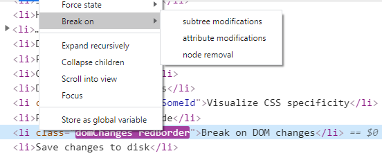

(class name will change redBorder -\> blueColor every 1 second)

Mean show me the Javascript that does what?

Break on subtree: something inside this tree is changing in some way

Break on attribute: some property of this element that's being changed
and I wanna know why.

Break on node removal: why is is getting removed?

Example: let break on attribute modifications.

It's waited for the change to happen and then it has moved us over into
the sources tab, opened up the file that needed the change, highlighted
it.

If you want to exit debug mode let deselect these breakpoint and hit
play button

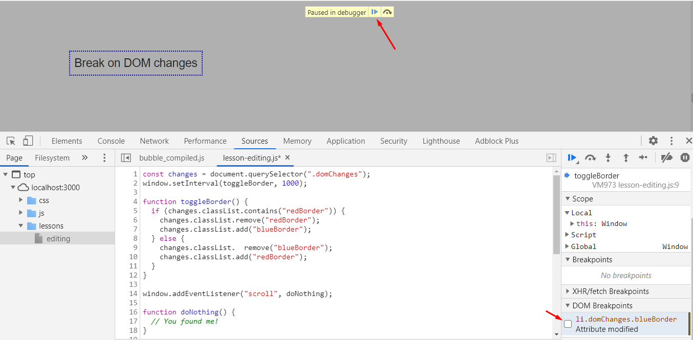

### Saving Changes in Workspaces

File system tab, Chrome is getting all these files from your local host
and then you can give Chrome a folder of your actual code. And Chrome
will start really trying to intelligently make mappings between those
things.

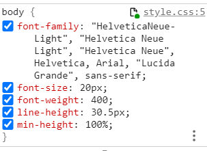

The green dot means it\'s sinking that it is mapped. And so that means
that anything that I change in here will persist, will be written down.

Example: let's change backgroud color from blue to red -\> go back VS
code, it will persist

-   What happen if we use SASS? Does it still work?

It will work, Chrome has built-in support for that. so you\'ll just drag
in your project with your Sass files. Chrome totally understands and can
make those transitions.

With webpack or some build tool, it still work perfectly. Because any
change that you make to your Sass file will reflect on the file system.
It\'ll kick off your build again, so that workflow will work well.

-   With the nav element, why couldn't I persist then?

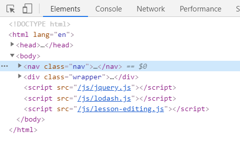

So as I would try to edit an element in here, Chrome has no way of
knowing where that came from right like Chrome has no way of knowing
that node turned the pub file into HTML or Chrome has no way of knowing
like which React component is responsible for creating and mounting that
element.

if you wanna change those kind of HTML files or anything like that,
you\'d have to go through the sources this tab open it up and make
changes like an editor.

-   Any way to add a new selector to file system file from styles tab,
    not switching the source, and manually writing it?

You\'re not able to do that. Because, develops this mapping

### Recent Selection History

This cool relationship between the elements and the console.

## Debugging

### Blackboxing

If you don't wanna debug jquery or react file, that's not your file. You
don't wanna ever stop in there. Just add to blackbox

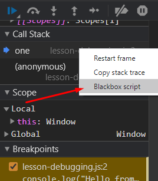 or

### Conditional & XHR Breakpoints

I only want you stop when a condition is met. It's call conditional
breakpoint

Stop if call api contains "something"

### Debug exercise

 run again

-   Know where it come from, debug it

## Networking

### Color Codes

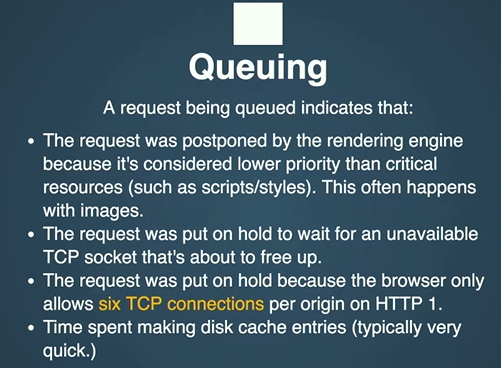

If you have a slow proxy server, you may spen time stuck in this gray
area where you're
waiting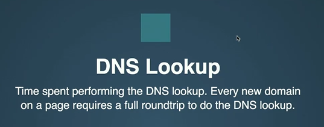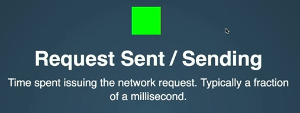

Example:

What kind of stuff is going on here (picture 2)?

DNS Lookup, it's probable the first time we're using that domain and
everything's taking a little long. Just like SSL, that whole connection
is taking a little bit more time than we're used to.

Why is queueing?

You've got too many connection. You can only do the six connection at
once.

### Screenshot

It'll help you see is how the webpage actually loads in. This is often
like too quicklt for us to see, but it's important.

## Auditing

### Auditing tools

-   <https://www.webpagetest.org/>

-   Lighthouse

-   <https://webhint.io/>

### Audit exercise

<https://github.com/jkup/mastering-chrome-devtools>

The problem is, the images are too big, it's take too long to load.

First of all, take all those images and size them down to be the correct
size.

The next thing we'd wanna do is go to our server and GZIP everything.
You'd wanna compress everything that you have.

GZIP is a compression format that the browers can decompress. And so
that means that it\'s just a way that you can make files smaller on the
server and the browser knows how to make them back into regular file
when they come down. So you get these huge savings for free.

## Node.js Profiling

### The \--inspect Flag

node \--inspect server/index.js

So a long call stack is nothing to worry about, just a bunch function
call each other. But a wide call stack is something to worry about. Why
did it take as long as it took?

Look at **Self time** and figure out what is going wrong.

## Performance Monitoring

### The Performance API

User monitoring, where you actually send code into production and your
user download it, and it can measure things and time things.

If you really wanna know how long it takes your users to do it, you
could just write code like this, this is totally safe to ship to
production. The only thing that you would need to add something at the
end that does like a post request or something.

## Image Performance

### Querying By Size

What image to load at what width?

For older browser

## Page Jank

### Performance Panel

We\'ve got the top one, FPS CPU NET.

The green stuff is frames per second. The lower the green line is, the
better, right? If you ever sight that its doing absolutely nothing, your
going to see it at all the way zero. As it start using a lot like as the
frames per second gets higher and higher, you\'re gonna see it kind of
coming up to the top. And when you see a bad example, that\'s **dropping
frames**, you\'ll start seeing a **red bar across the top** of those.

The second thing we\'re gonna see is what the CPU was doing. JavaScript
is single-threaded, so this is all of the rendering, all of the
painting, all of the JavaScript work that\'s being done. In the summary,
we\'ve got a little bit of JavaScript, those yellow spikes. Mostly
we\'ve got rendering, we\'ve got very little bit of painting too.

The main tab, that\'s like almost always what I have here. Tall not a
problem, there is a lot of stuff calling each other. Wide is what we
start with look for, and its not necessarily a bit of a problem.

when Chrome thinks that your doing too much stuff and your dropping
frames, they\'ll start marking these with little red boxes on them. So
red boxes are always the way you can tell, I definitely have a problem

What we really wanna know is what triggered that layout, right? So what
we really wanna see is here in this yellow before the big layout. Like
what did we trigger in our yellow JavaScript code before that purple
layout happened? So we can kinda start drilling in here.

This recalculate style because it keeps appending children, right?

### Page Jank Exercise

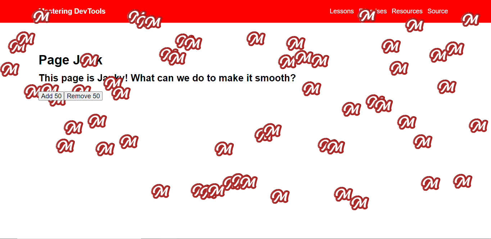

Problem is layout thrashing -\> separate read and write element

We don\'t have control over how Google Chrome paints or renders, but we
do have control over what it renders and when with our JavaScript.

Just try to stay away from the dom as much as possible, keep things in
CPU memory.

## Memory

### Causes of Memory Leaks

What we call a memory leak in Javascript is when something can't be
released.

-   Common causes of JS memory leak

{

That variable lives on the global window object

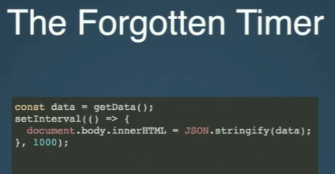

We are removing the buttom from the DOM, but we haven't removed our
handler to that global button variable

### Chrome Task Manager & Snapshots

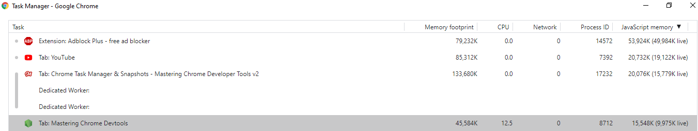

If your site's just sitting here and your Javascript memory usage is
going up, that's a really good way of knowing you have a memory leak.

The performance tab is the best one for spotting a memory leak, the
memory tab is the best one for figuring out what's going on.

-   Remember: when you're doing performance recordings for CPU, you make
    them as short as possible. When you're doing performance recordings
    for memory, you wanna do them longer.

So this yellow, this event listener is a great example. So the page
starts, and they start reasonably high, a decent amount of memory being
used. And then they finish and a garbage collection happens here. And
then they\'re done, right? Then yellow is back to this, just one.
Whereas the blue, you see it kind of starts off its thing here. And it
does clean and then it just starts growing and growing and growing and
growing and we\'re not doing anything. This might be normal if it was
calculating something, but for a page just to be sitting here, we
shouldn\'t be seeing these jigsaws, right?

And so this is always the shape that you want to watch for is this up
and up and up jigsaw.

A cool thing about this is that it tells you specifically what type of
memory it is. So it breaks it into JavaScript memory, document memory
nodes, like elements and event listeners. And it kind of breaks into
those categories so at least you have some clue of where to start with
it.

The next thing is memory tab, basically they have these kind of three
tools for analyzing memory to figuring out what\'s using that memory?

-   The first one is a heap snapshot, so it just grabs the whole memory
    heap, everything that\'s being used, and it\'ll show it to you. So
    you can see what\'s using the most memory. But what\'s also really
    neat about them is you can take multiple and compare them to each
    other. So you can take one, give it a few seconds, take another one,
    compare them to each other, see what\'s changed.

> *Before we get too much further I wanna get into the concept of
> garbage collection. So with scripting languages where you\'re not
> manually allocating and deallocating memory, there\'s this kind of
> garbage collection. And the basic idea, it\'s called the mark and
> sweep technique. So the idea is it looks at everything that you have
> and it\'s like, are you still using this? That\'s basically the very
> simple idea. It goes from thing to thing and it\'s like are you using
> this, cool, I\'ll keep it, no I\'m gonna get rid of it then.*
>
> *Example: if you make an array and you do console.log it and then
> nothing else in that function completes and nothing else has any
> pointers added or anything like that. JavaScript closures, as long as
> that inner function is around, you can\'t get rid of the outer
> function cuz at any time it might call in to that, right? And so you
> kinda get these concepts where it\'s like, these are kinda pointers.
> Is there anything that\'s still around that\'s pointing at it? If
> there is, then we can\'t get rid of it. If there\'s not, then we can
> totally get rid of it.*

In memory tab, what you see is you see this concept of shallow and
retained size. Shallow is how big are you? If you're an array with 50
items in it, that is your size. If you're variable that points to
another array that has a million items in it. As a variable you're
pretty small, But the thing that you point to and what retained size
means is if I could get rid of you, that would let me get rid of all
these other things, too, right?

Then your shallow size is gonna be really small, but your retained size,
meaning the size that we could free up if we were able to get rid of
you, is pretty large.

Take a new snapshot and let comparision:

The memory panel is not keeping track of what code created that thing.
So it gets a little bit harder. But it can give you a lot of really good
insight on what the problem is. Is there a memory leak, what\'s causing
it, what type of information is there?

-   Beyond that, you can do these kind of allocations. And so these are
    really cool, these kind of allocations over time. It\'s basically
    the same as taking a bunch of heap snapshots, but you can start
    seeing, is the memory going up and up and up?

-   Then this one is like on allocation sampling. So basically it\'s
    like, takes it over a long period of time, it\'ll take a bunch of
    different samples there. Example, you have a website, it seems after
    about an hour of use, the site gets really slow. That\'s harder to
    debug, right? So we can do one of these samplings and we can just go
    back to using the site. As it gets slow we can end it, and then we
    can see what\'s going on.

But for today\'s stuff we can just get away with just some heap
snapshots, or we can do the allocation time line.
