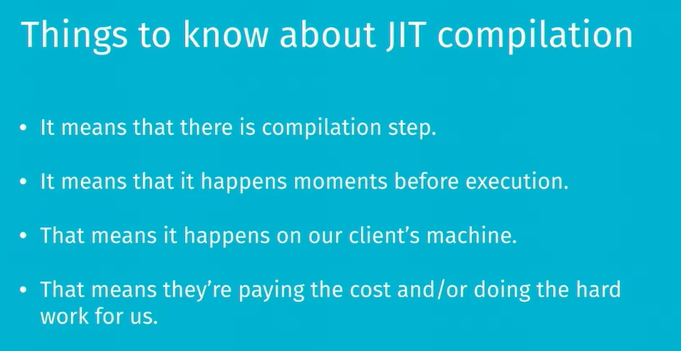
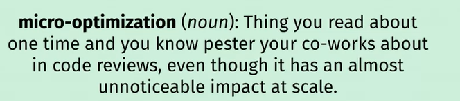
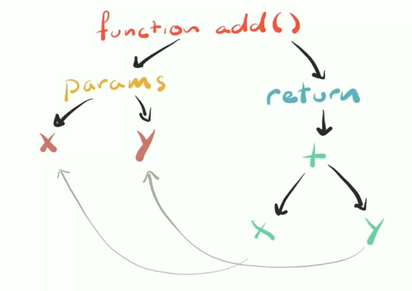
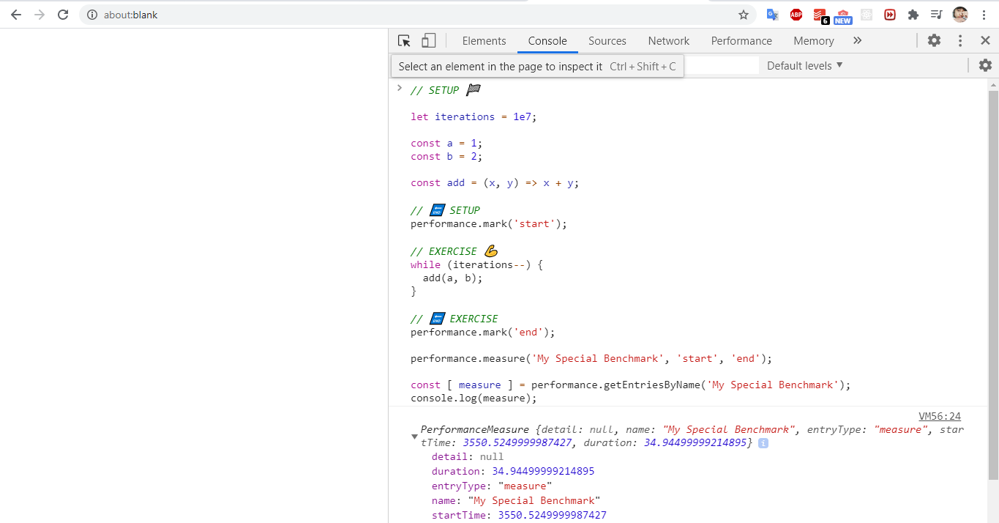
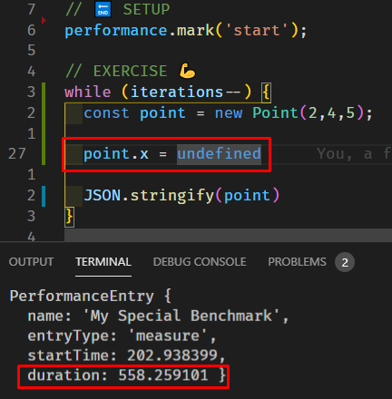
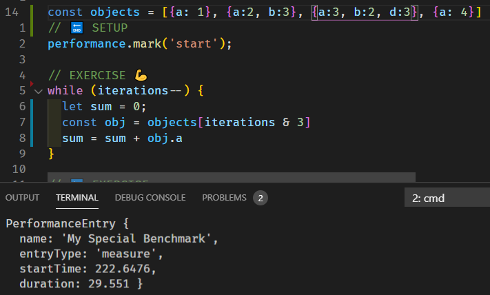
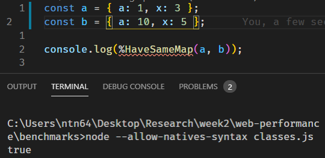
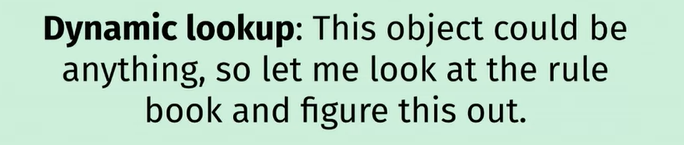

**Đây là bản tóm tắt của khoá học Javascript performance (part 1), nên
học khoá học trực tiếp để nắm rõ kiến thức hơn**

<https://frontendmasters.com/courses/web-performance>

**Tóm tắt:**

I. Introduction

1\. Thinking About Performance

\+ Nêu một số thống kê, tầm quan trọng của performance ảnh hướng đến sản
phẩm

\+ Giới thiệu 3 loại performance: network load, compliation, rendering

\+ Giới thiệu cái con số dùng để đo trong performance

2\. The Importance of Measurement

\+ Measure là việc quan trọng nhất, cần phải làm trong khi optimize
performance. Có thể áp dụng kĩ thuật này và cho kết quả performance tốt
trên chrome nhưng lại có kết quả ngược lại trên Safari. Do đó, measure
là điều quan trọng nhất khi thực hiện optimize performance.

\+ Golden rules of performance: not doing stuff is faster than doing
stuff, doing stuff later is a way not doing stuff now.

II\. Javascript performance

1\. The Cost of JavaScript

\+ Javascript dành thời rất lớn thời gian cho scripting: bao gồm parsing
và compiling Javascript

\+ Giới thiệu về quy trình browser xử lý Javascript code:

User truy cập vào trang web, nhận code js từ cloud -\> gửi js code về
browser và parse -\> ra được abstract syntax tree -\> đưa qua cái gọi là
interpreter hoặc baseline compiler -\> chuyển thành byte code và thực
thi trên browser

Ngoài interpreter còn có compiler thứ 2 gọi là Turbofan, đây là
optimizing compiler, nếu code có thể optimize được thì tiến hành
optimize giúp thức thi nhanh hơn, nếu không sẽ chuyển thành byte code

2\. Parsing

\+ Parsing sẽ tiến hành 2 phases:

-   Eager: parse tất cả các code mà thực sự làm việc gì đó

-   Lazy: parse ở mức tối thiểu, sẽ parse sau đó khi thực sự cần thiết
    (như function declarations và class)

\+ Vì vậy nhiều lúc ta không cần thực hiện phases lazy và muốn bỏ qua
thực hiện ngay eager để tăng performance

3/4. Reducing Parsing Times Exercise/ Solution

\+ Thực hiện chạy thử optimize-js và measure đánh giá optimize
performance

5\. ASTs and Initial Execution

\+ Giới thiệu abstract syntax tree

\+ Ta không thể optimize ở bước này

6/7. The Optimizing Compiler

Sau khi có abstract syntax tree ta chuyển đến ignition, optimize
compiler

\+ Thực hiện code và measure để giải thích ảnh hưởng của optimize
compiler như thế nào

\+ Javascript dynamic type, nên nó có rất nhiều rule để kiểm tra khi
thực hiện -\> làm chậm performance. Vì vậy nó có các thuật toán
optimize, nếu nó được thực hiện nhiều lần với type không đổi thì sẽ giả
định không thay đổi type nên bỏ qua việc check việc này sẽ làm tăng
performance hơn. Tuy nhiên, nếu nhận ra có thay đổi type, thì sẽ thực
hiện re-optimize lại. -\> slow performance

Nên trong khi code, hạn chế thay đổi type với đặc biệt trong loop (for,
while) được thực hiện nhiều lần. Sử dụng các framework như Typescript sẽ
giải quyết được vấn đề này

8/9. Deleting, Feeding Objects

\+ Đừng bao giờ xoá properties nếu không nó sẽ làm chậm object. Ta có
thể set property bằng undefined thay vì goi delete object.property

10\. Monomorphism, Polymorphism, and Megamorphism

\+ The more consistent stuff is, the more speculative optimizations can
be done, the faster your code is.

\+ Ví dụ: trong 1 mảng object, các object không có type đồng nhất sẽ làm
chậm performance

11\. Optimizing Objects

\+ Các vấn đề về việc check type object

12\. Hidden Classes (V8)

\+ Giải thích về quá trình check type của object

\+ Về cơ bản, 2 object được xem là giống nhau nếu nó được tạo giống
nhau, lúc xoá thứ tự cũng phải giống nhau. Ví dụ: 2 object khởi tạo có
số property khác nhau, thì sau 1 quá trình thực hiện nào đó, kể cả 2
object có kết quả giống nhau hoàn toàn thì nó vẫn cho là khác nhau.

\+ Tìm hiểu rõ hơn ở:
<https://kipalog.com/posts/Vai-net-ve-V8---Javascript-Engine-dang-sau-Chrome-va-Node-js>

13\. Scoping and Prototypes

\+ Khởi tạo function hay class trong một function sẽ ảnh hưởng đến
performance, vì nó luôn tạo mới khi gọi

Mục lục
=======

I. [Introduction](#introduction)

1. [Thinking About Performance](#thinking-about-performance)

2. [The Importance of Measurement](#the-importance-of-measurement)

II. [Javascript performance](#javascript-performance)

1. [The Cost of JavaScript](#the-cost-of-javascript)

2. [Parsing](#parsing)

3. [Reducing Parsing Times Exercise](#reducing-parsing-times-exercise)

4. [Reducing Parsing Times Solution](#reducing-parsing-times-solution)

5. [ASTs and Initial Execution](#asts-and-initial-execution)

6. [The Optimizing Compiler](#the-optimizing-compiler)

7. [Deoptimization, Deleting Properties](#deoptimization,-deleting-properties)

8. [Deleting, Feeding Objects Exercise](#deleting,-feeding-objects-exercise)

9. [Deleting, Feeding Objects Solution](#deleting,-feeding-objects-solution)

10. [Monomorphism, Polymorphism, and Megamorphism](#monomorphism-polymorphism-and-megamorphism)

11. [Optimizing Objects](#optimizing-objects)

12. [Hidden Classes](#hidden-classes)

13. [Scoping and Prototypes](#scoping-and-prototypes)

14. [JavaScript Performance Takeaways](#javascript-performance-takeaways)

## Introduction

### Thinking About Performance

-   Some statistics:

\+ The Aberdeen Group found that a 1 second slow down resulted in 11%
fewer page views and 7% less conversion

\+ Akamai found that a 2 second delay in web page load time increased
bounce rates by 103%. So double the amount of people are leaving if your
page is two seconds slower to load

\+ A 400 millisecond improvement in performance resulted in a 9%
increase in traffic at Yahoo

+Google found that a 2% slower page resulted in 2% fewer searches, which
given Google\'s business model means 2% fewer ads shown and you can see
how that kind of fike trickles down the entire thing.

\+ 100 millisecond improvement in performance results in a 1% increase
in the overall revenue at Amazon.

\+ 53% of users will leave a mobile site if it takes more than 3 seconds
to load

And I think the one general one makes a lot of sense in the research is
that if you want your application or your site to feel faster, you need
to be about 20% faster than your competitors

-   Three different kinds of performance:

\+ Network load performance

\+ Compilation performance: parsing and javascript. So learning how that
stuff works under the hood allows us to kind of one analyze and make
some decisions and see where the hurt is, and two refactor our code in
such a way that it is easier on the parser and compiler and all those
things.

\+ Rendering performance:

-   RAIL stands for Response Animation Idle and Load

### The Importance of Measurement

-   Don\'t tune for speed until you\'ve measured, and even then don\'t
    unless one part overwhelms the rest.

We want to make sure we know what\'s happening because every abstraction
has some kind of trade-off. it\'s like the Chrome team implemented this
one feature to make things faster most of the time, but it turns out
that some of the time it makes some of the things slower.

the way you architect the application, itself, can make stuff faster
before you even worry about the actual parts and compilation
performance. Sometimes it\'s like, you actually have a table with 1000
rows on the page. And having all those rows in the DOM is slow. What if
you just added pagination?

-   Three tires of advice:

\+ Definitely do this

\+ Maybe do this, but measure before and faster

\+ Only do this if you find a performance problem that needs solving

-   Two golden rules of performance

\+ Doing less stuff takes less time: not doing something is way faster
than doing something.

\+ Doing stuff later is better than doing it now: when in doubt, if you
can get away with not doing it, don\'t do it. If you have to do it and
you can do it later

\+ Javascript performance: we\'ll talk a little bit about how your
JavaScript is compiled. We send this text file over to the browser. we
talk about how JavaScript engine works. We\'ll look at V8 in specific.
We\'ll actually see how the entire process of, you sent code. There is
code on page, actually happens under the hood. And we\'ll actually
benchmark it ourselves and try to optimize and unoptimize stuff and see
what happens.

## Javascript performance

### The Cost of JavaScript

Application\'s eventually going to need to be run and built, and you
don\'t get to control, the computer that it\'s run on.

-   Sometimes, parsing and compling is the real culprit

I spent the majority of the time scripting, which is parsing and
compiling the Java Script.

-   How does Javascript even work?

JavaScript is a compiled language, just like C or Java, it is put
through a compiler, and out comes, some byte coder, some machine code.

it uses a thing called just-in-time compilation.

We\'ve identified it as a problem. Were gonna focus, each browser has a
different engine. Chrome has an engine called V8. Safari has one called
JavaScript core. Firefox has one called Spider Monkey.

We\'re gonna just focus on V8.

So our JavaScript lives in this thing called, the cloud. When I do a
webpack build, I put it in the cloud, and people get it from there -\>
So we send the JavaScript to the browser, and then we have to parse it
-\> We turn that into what\'s called an abstract syntax tree, which is
an actual data structure that represents what this code actually means
-\> then goes to a baseline compiler or an interpreter. In Chrome, these
days is a thing called Ignition. It\'s V8 Ignition -\> That gets turned
into byte code, that gets executed by the browser.

JavaScript is really hard, it\'s this dynamic language, It\'d be great,
if we could make some of it faster. So there\'s a second compiler in
there. This one\'s called Turbofan. it\'s an optimizing compiler, that
then looks at the code, and tries to make it even faster. That will spit
out, any code that can be optimized, any code that can\'t be optimized.
Any code that can be optimized, goes to the optimizing compiler to get
optimized, whatever it does in there -\> then, that\'s spits out highly
optimized machine code. Some cases though, you\'re super optimized code,
isn\'t gonna work out -\> At which point, we go back to using the slow
byte code

-   So it stands to reason, that red arrow\'s bad. If you can get stuff
    on the green arrow, that\'s good. And any time we end with the red
    arrow, that\'s not good. And so, one way to make your application
    faster, is more green arrows, less red arrows.

-   Doing less work, more green arrows, less red arrows. Shorter yellow
    slugs

### Parsing

-   Parsing is slow. As slow as 1MB/s on mobile

So one way to reduce the parsing time Is to have less code to parse. If
there\'s things you can parse later, parse it later.

But that could bite us. Here\'s an example

-   Do you see the problem here?\
    It\'s out of order but we\'re also lazy parsing it and then we have
    to immediately eager parse it. **Doing stuff twice is slower than
    doing it once** right.

if we actually wrap something in parentheses, it will actually get eager
parsed.

Does that mean that you should go ahead and wrap every function in your
application in parentheses? No right?

It\'s helpful to know that happens. One that\'s we we call
micro-optimatization which is a long fancy word for saying I wanna get
my co-workers to hate me. And if you wrap every function in parentheses
you\'re basically opting out of all lazy parsing, which kind of defeats
the purpose.

Better than that, there\'s usually libraries that will help you. This
one is called [OptimizeJS](https://github.com/nolanlawson/optimize-js)
with the help of parsing. It will go through and try to figure out, not
every time, to wrap everything in parentheses, because that would be
bad. What it does is it goes ahead and parses your code to figure out
some of the common cases where did I have to go and immediately eager
parse it afterwards

### Reducing Parsing Times Exercise

<https://nolanlawson.github.io/test-optimize-js/>

Open it up, we\'re going to try out some different libraries. But what
I\'d also like you to do is try it in some different browsers.

### Reducing Parsing Times Solution

Basically optimize-js tries to figure out ways to do things that would
have been lazy. And then eager parsed, to just skip to the eager
parsing, because doing it once is faster.

Chrome

MicrosoftEdge

if we take a bunch of libraries, and we run it through, we can see that
In Chrome 55.

Generally speaking there is a noticeable improvement across most of the
applications.

But it is not as straightforward on Edge 14. if you\'re using PouchDB,
well it\'s 32% slower. if we just follow these rules, put these
parentheses everywhere. You could be making applications slower. You can
be making applications faster, so that\'s why **it\'s really important
to measure.**

-   the kind of moral of the story here is to make sure that you\'re
    measuring. Looking to see what the actual impacts and implications
    of these things are. Rather than just following some rule that I
    told you. Treat me with a healthy dose of skepticism, and every word
    that\'s coming out of my mouth. Take those words, measure them
    against your application, then make a decision.

when ES6 originally came out. All of the ES6 stuff that was for the
browser was slower than the ES5 stuff. So it would be very easy to ,read
a blog post then and believe that ES6 was inherently slower. It was
slower because browser inventors had ten years to optimize. And figure
out all the edge cases for the ES5 stuff and the ES6 stuff was brand
new. Three years later, that is not true anymore right? Because the
browser vendors are attempting to get better and faster with these
things. So generally speaking, all these things are a moving target.

-   Which is why measure early, measure often

There are also Webpack plugins, we can just insert this into your build
pipeline as well <https://www.npmjs.com/package/optimize-js-plugin>

### ASTs and Initial Execution

So our code is parsed. Then what? You just turn it into an abstract
syntax tree.

*"In computer science, an abstract syntax tree, AST, is a tree
representation of the abstract syntactic structure of source code
written in a programming language."*

is like we took the string of text, we made a data structure that
basically shows the structure of the actual code as it\'s gonna be
executed.

So we have the AST, we have everything we need to make byte code. We
can\'t optimize it. Let\'s pass it to ignition

### The Optimizing Compiler

The reason that what makes the optimizing compiler faster is the like
removal of the things that make the interpreter slower. Cuz JavaScript
is hard and JavaScript is dynamic and JavaScript has a lot of rules.

So let\'s say we get an add function, add x and y it returns x plus y.
what if I give it strings? It concatenates them, what if I give it a
string and an object? It calls two string on the object, and then
concatenates that with the first one. There\'s a lot of rules in the
JavaScript spec, and the interpreter has no idea, what\'s gonna happen
here.

-   if we can skip all of those kinda crazy rules and concatenation and
    do I need to throw an error and be ready for that. If we can
    eliminate all of that, we can execute the JavaScript way faster

-   We\'re gonna go ahead and look at some code

const { performance } = require(\'perf_hooks\');

required node 8.5 and later, I using 9.8.0. This performance object
gives us a whole bunch, it\'s basically implementing what\'s called the
user timing API, which is also supported in Chrome.

node benchmark.js

-   

In chrome:

Let's try it with performance dev tool

what I want to draw your attention to is right here, right? I can put my
own entries into what\'s called the timings portion of the co-developer
tools. Use the timing if it has really useful for this cuz you can
basically set your mark a start time, you mark an end time, and then you
can do this measure where you can give it whatever name you want.

Example, I think some of the hurt is here, you can put a, you can mark
the start time of the thing that you think is hurting. You can mark the
end time and you can actually put that into the Chrome developer tools,
do a performance recording and then see when those things are happening
and how long they are taking. Which is super interesting. And a really
great way to debug.

We\'ll see later that react actually in development mode uses this out
of the box. So you can actually see when a component started mounting,
when it finally mounted.

-   V8 has a bunch of flags that you can set to get more information
    about what\'s going on

-   we compile it with Turbo Fan, it completes the optimizing very cool.

We can do grep add, which will find every line with the name of the
function in it, and we\'ll get a little bit less noise.

### Deoptimization, Deleting Properties

Let's try Deoptimizing

It's only optimized, but if we doing something like this

-   Deoptimizing the function

-   Let\'s try something else up. I\'m gonna do it twice.

It's almost equal with do it one time, just a lit bit longer. But if we
do this:

-   almost double the amount of time (Note: if we put this line in the
    end, it will the same in example above)

-   there\'s definitely a problem there. It definitely caused some kind
    of slow down

We can do something like this:

-   We use a system called speculative optimization.

Example: I would do a bunch of hard work. I will look everything up
It\'s all gonna be fine. It goes and it gets ahead and it\'s doing it
the slow way. Eventually it\'s like hey it\'s generating these feedback
objects that are going to turbofans like, I think I know enough about
how people are calling this add function that I think that I\'m ready to
make the decision. t always gets two numbers, right? And once we know
enough about it we can assume that even this untyped wild west of a
programming language That yeah there\'s not type, no guarantees, but
we\'re pretty certain that numbers are going to get passed in every time
and that\'s when it becomes a candidate for being optimized.

-   But what if a string slips in there? everything I thought happens
    isn\'t true. At that point, we get the red arrow.\
    

I clearly can\'t handle this. Which when we go back to the byte code

*"The optimizing compiler optimizes for what it\'s seen but if it sees
something new. That\'s problematic"*

It turns out that like a few times it will alright. I\'m ready to
re-optimize if that happens enough times cuz like that cost is expensive
the de-optimizing compiler which is like I don\'t touch this function
anymore

-   Question: If you\'re using something like flow or Typescript where
    you\'re defining the types. Is that\'s something they optimize or
    can like handle and like be aware of or?

Answer: yes, That you\'re always trying to hand the same types in will
effectively speed up. It is less likely that you\'ll end up with code
that is not of that type, right? You are helping turbofan help you at
those points. So there are potential performance gains in those cases.

### Deleting, Feeding Objects Exercise

-   What's happen?

### Deleting, Feeding Objects Solution

Seems to me that if we delete the last one, we\'re okay

-   Never delete anything because deleting any of the properties would
    have slowed the object down.\
    Turbofan is slightly smart enough to know if you delete the last
    one, which a lot of times is the one you\'re deleting, it\'s
    optimized for that case. But deleting properties is slow

### Monomorphism, Polymorphism, and Megamorphism

}

Terminology we use is the morphism of that object.

So we can say that in the case that a function could be monomorphic. we
passed a whole bunch of objects that only had an A property, that A
property was a number. Monomorphic, it\'s the same thing every time.

There\'s polymorphic, which is I see many things or see a few things.
Sometimes there\'s a B on it, sometimes there\'s a C, it\'s generally
the same. I\'ve seen it just a subset of things, I can basically go in
this case, I\'m gonna optimize here. In this other case I\'m gonna
optimize there, I\'ll figure it out.

There\'s megamorphism, which is a whole bunch of different things. I
don\'t know what\'s happening, I don\'t know what to expect. I\'m not
gonna optimize this situation.

-   the more consistent stuff is, the more speculative optimizations can
    be done, the faster your code is.

### Optimizing Objects

How does the browser figure out the type of something is?

HaveSameMap is the hidden VA special functions. Are the two of them
monomorphic?

After you pass a 32 bit integer, it\'s not the same small number
anymore. If you\'re under a 32 bit number like, if you keep your numbers
small, they are the same type.

### Hidden Classes

computers are good at doing repetitive work that we don\'t wanna do but
they\'re also good at remembering things and not doing it.

So what V8 does is it keeps a secret type system that it doesn\'t tell
you about behind your back.

So it\'s like, you asked me for x on this object before. I\'ll do the
lookup, it\'s fine. But things where everything was exactly the same, it
was like I know about this object. I\'ve done this. I\'ve read the
rulebook, I\'ve seen this kind of object before. I know what to do, I
will do it faster for you.

-   so everything gets this thing called a Hidden Class. That\'s what
    it\'s called in Chrome, it\'s called something different in Firefox,
    it\'s called something different in Safari.

So if the path that an object went down to get to the properties that is
has is different. We can\'t use the cached version of the lookup. We
have to go ahead and go through the process every time. So like you can
only move forward in the chain, you can not, like we went from C0 to C1.
You can\'t start at C1. So you have C0, we have the property, becomes
C1. Ignore that.

-   So that\'s useful when we try to think about how we make our objects
    and what we do to our objects. If we can keep them going along the
    same path and we do things in a very systematic way. So when we make
    functions for doing things vs the functions going to run the same
    way every time

### Scoping and Prototypes

They don't have the same map. It\'s way slower

When we make the point inside of a function, it\'s not parsing,
theoretically. We\'re making this class as a different prototype chain
every time, right, which means that each one of these points that come
out of here points to a different prototype object. We\'re making a
fresh point function every time, so on and so forth.

-   Turbofan is able to optimize your code in substantial ways if you
    pass it consistent values.\
    So what does that really mean for us?

> \+ Initialize your properties at creation: If you can have a function
> that creates the object, rather than you doing it by hand every time,
> if you\'re always making a object literal, you could type the curly
> braces and the properties, right? But if you know if you\'re using a
> lot, it might make sense to make a function that gives you a
> consistent object that was created the same way every time. And that
> way, you don\'t have to think about this. Cuz that will have the same
> map as all the other objects made that way.
>
> \+ Initialize them in the same order
>
> \+ Try not to modify them after the fact
>
> \+ Maybe just use Typescript or Flow so you don't have to worry about
> these thing

### JavaScript Performance Takeaways

