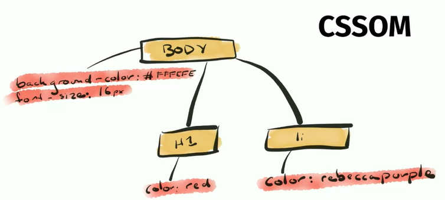
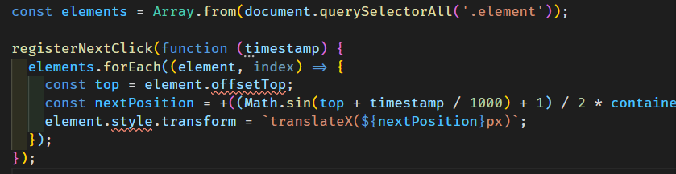
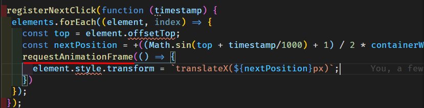
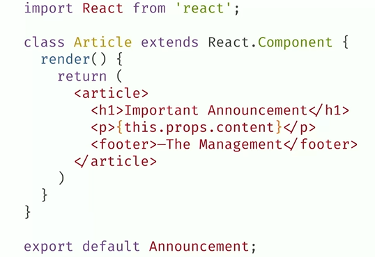

**Đây là bản tóm tắt của khoá học Javascript performance (part 2), nên
học khoá học trực tiếp để nắm rõ kiến thức hơn**

<https://frontendmasters.com/courses/web-performance>

**Tóm tắt:**

III\. Rendering Performance

1\. How Web Pages Are Built

\+ Sau khi có file html, css, javascript từ server.

-   Từ html, parse ra cấu trúc của page là cây document object model
    (DOM)

-   Từ css, tương tự parse cấu trúc CSS object model chứa tất cả các
    rule css

-   Gộp 2 cái lại ta có render tree (what page look like? Chỉ gồm những
    element hiển thị trên page)

\+ Quá trình để xác định element trong như thế nào gọi là style
calculation. Selector càng đơn gian thì quá trình thực hiện càng nhanh.
Xoá các CSS dư thừa, giảm bớt các style lên element.

2\. JavaScript and the Render Pipeline

Chi tiết:
<https://nthung2112.github.io/2018/06/Toi-uu-hieu-suat-render-de-website-muot-hon.html?fbclid=IwAR1kFZO_6JmO24a26ekR_hn0fbA3dfL6GletNF6t37cwOQksSStIBxRNeXQ>

\+ Render pipeline: javascript -\> style -\> layout -\> paint -\>
composite

\+ Các hành động ảnh hưởng đến quá trình render

-   Thay đổi class: cần phải thực hiện lại 1 số phần trong quá trình
    rendering

-   Thay đổi inline style: tương tự class, ngoại trừ các thay đổi như
    màu sắc

-   Thêm hoặc xoá element: re-layout page

\+ Khi layout thay đổi thì cần phải repaint lại page

\+ Để tăng performance, khi styling ta cần bỏ qua 1 số bước để giảm bớt
công việc như layout, paint

3\. Layouts and Reflows

\+ Reflow: khi có thay đổi, tôi cần phải update lại layout. Khi hình
dạng/hình học của element thay đổi browser sẽ reflow lại page

\+ 95% of the time you reflow a thing, you\'re reflowing everything. A
reflow of an element causes a reflow of its parents and children.

\+ Layout is the second most expensive part of the rendering pipeline
and the first one is painting

\+ Cách tránh/hạn chế reflow:

-   Thay đổi class ở level thấp nhất của DOM tree

-   Tránh chỉnh sửa inline style nhiều lần

-   Trade smoothness for speed if you're doing an animationư

-   Avoid table layouts

4/5. Layout Thrashing

\+ Hiện tượng write và read từ DOM nhiều lần gây ra reflow -\> Separate
reading from writing.

6\. FastDOM

\+ Thư viện hỗ trợ tránh reflow và tăng layout performance

7\. Frameworks and Layout Thrashing

\+ Lợi ích khi sự dụng frame: ví dụ quán lý dựa vào state thay vì thao
tác trức tiếp với DOM ở trong react

8\. Painting

\+ Nếu bạn chỉ thay đổi color hoặc một số thứ khác thì chỉ cần repain
không cần phải reflow

9\. The Compositor Thread

\+ Giới thiệu các thread:

-   The UI thread

-   The Renderer thread

-   The Compositor thread

Renderer thread đảm nhiệm nhiều trách nhiệm hơn như calculate style,
paint, layout nên nếu có thể thì giảm tải nhường cho thread làm.

10\. Managing Layers

\+ Cách để tránh painting là sử dụng các layer: phân chia các layer làm
sao cho browser ít vẽ lại nhất

\+ Các layer mặc định: root page, element được set position (ví dụ:
fixed), css transform, overflow, \...

11\. will-change

\+ Có nhắc nhở browser tạo layer bằng cách set will-change: "something"
hoặc dùng trick transform: "translateZ(0)". Hạn chế sử dụng trick này,
will-change tốt hơn

\+ Tạo mới layer sẽ yêu cầu thêm bộ nhớ và tác vụ để quản lý vì vậy
không nên tạo quá nhiều layer

\+ **Tip:** will-change is for things that will change (not things that
are changing)

12\. Applying will-change with JavaScript

\+ Ví dụ: khi ta hover vào 1 element và tiếp theo element "will change"
thì ta set will-change cho nó để tạo layer tránh repaint lại những phần
xung quanh không cần thiết. Tuy nhiên cần phải clean up khi nó not going
to change anymore

IV\. Load Performance

1\. Latency and Bandwidth

\+ Đi qua các vấn đề vè latency và bandwidth

2\. Caching

Các kĩ thuật caching:

\+ no-store: browser gets a new version every time.

\+ no-cache: you can store a copy, but you can't use it without checking
with the server.

\+ max-age: cache trong 1 khoảng thời gian nhất định

Vấn đề: nếu đó là 1 file hỏng hoặc lỗi thời thì sao

Giải pháp: tên file được generate unique mỗi khi rebuild

Một giải pháp khác đó là caching ở CDN

\+ s-maxage: for CDNs only. Tell the CDN to keep it forever. But don't
tell the browser to do it.

3\. Service Workers

4\. Lazy Loading

5\. HTTP/2

\+ So với HTTP/1.1: là bản nâng cấp từ HTTP/1.1, có thể send nhiều
request song song

\+ Không phải lúc nào HTTP/2 cũng tốt hơn HTTP/1.1 cần phải measure, dựa
vào traffic để quyết định phù hợp

V. Tools

1\. Introduction to Using Build Tools

2\. Paying the Babal Tax

\+ Babel cho phép chuyển đổi code sang phiên bản thấp hơn phù hợp với
older browser. Tuy nhiên, hạn chế của nó là khi parse nó sẽ ra nhiều
code hơn.

3\. Useful Babel Plugins

\+ Babel-preset-env: chỉ nhắm vào phiên bản browser nhất định

\+ \@babel/plugin-transform-react-remove-prop-types: proptype không cần
ở production mode

\+ Babel-plugin-transform-react-pure-class-to-function

\+ \@babel/plugin-transform-react-inline-elements

\+ \@babel/pluin-transform-react-constant-elements

Mục lục {#mục-lục .TOC-Heading}
=======

III\. Rendering Performance 4

1. [How Web Pages Are Built](#how-web-pages-are-built)

2. [JavaScript and the Render Pipeline](#javascript-and-the-render-pipeline)

3. [Layouts and Reflows](#layouts-and-reflows)

4. [Layout Thrashing (forced synchronous layout)](#layout-thrashing-forced-synchronous-layout)

5. [Solving for Layout Trashing](#solving-for-layout-trashing)

6. [FastDOM](#fastdom)

7. [Frameworks and Layout Thrashing](#frameworks-and-layout-thrashing)

8. [Painting](#painting)

9. [The Compositor Thread](#the-compositor-thread)

10. [Managing Layers](#managing-layers)

11. [will-change](#will-change)

12. [Applying will-change with JavaScript](#applying-will-change-with-javascript)

13. [Will-change exercise](#will-change-exercise)

14. [Will-change solutions](#will-change-solutions)

IV. [Load Performance](#load-performance)

1. [Latency and Bandwidth](#latency-and-bandwidth)

2. [Caching](#caching)

3. [Service Workers](#service-workers)

4. [Lazy Loading](#lazy-loading)

5. [HTTP/2](#http/2)

V. [Tools](#tools)

1. [Introduction to Using Build Tools](#introduction-to-using-build-tools)

2. [Paying the Babal Tax](#paying-the-babal-tax)

3. [Useful Babel Plugins](#useful-babel-plugins)

VI. [Wrapping Up](#wrapping-up)

1. [Final Thoughts](#final-thoughts)

## Rendering Performance

### How Web Pages Are Built

Let\'s talk e a little bit about how web pages are born.

The step one is the browser goes ahead sends get request to a server. We
get back a response and guess what it has in it? A webpage, like
typically HTML. The HTML is just a big sting of text and likely has
other things that we need to get like Style Sheets, JavaScript files, so
on and so forth.

That HTML also needs to parsed and figure out like what is the actual
structure of this page. We parse it into this thing called the document
object model (DOM) 

We saw that link to go get some CSS. We need to go fetch that as well.
And that gets turned into this other very similar archetype called the
CSS object model. 

Which is just basically a giant tree of all the rules for how our page
should look. So we have an entire structure of how the web page or web
application is laid out.

In order to figure out what the page looks like we have to take the
state of the world and the rules about the world and we put them
together into this thing called the render tree.

We don\'t have that HTML anymore and we don\'t have the head, right?
It\'s only the parts that will actually show up on the page. we don\'t
need to worry about how to style things we\'re not going to show.

So basically the structure of our page along with the computive rules.
It take all the CSS and all the rules and figure it all out and tell me
what this given element on this part of the DOM should look like, and
this other given element, so on and so forth.

-   The process that we figure that out is called style calculation.

-   The other thing that we have to keep in mind is Styling Elements:
    **Selector matching**, figuring out which rules apply. Cuz it can be
    a little bit tricky. We could have stuff like all p rules in CSS
    apply to the paragraphs. We could also have some a slightly more
    complicated one, like nth child 4n- 1. That takes a little more work
    to figure out.

So the more complicated you end up making your selectors, the longer
this whole process is going to take. So easy rule of thumb, class names
are super simple. Like, does this have the class of header or footer, or
whatever? That\'s a yes or no question. That\'s very easy to figure out.
But when we get to the point where it\'s going off the page of sidebar,
the first descendant of menu-item, the nth-child, that takes a lot
longer. (.sidebar \> .menu-item: nth-child(4n + 1))

-   when possible you can always speed up the time of calculating all
    the styles and matching to the elements by keeping it as simple as
    possible

-   Layout: Look at the elements and figure out where they go on the
    page

-   Paint: We know what things should look like and where they should
    go. Draw some pixels to the screen.

### JavaScript and the Render Pipeline

-   Things Javascript can do: an incomplete list

\+ Change the class on an object: we need to do some part of the
rendering process all over again

\+ Change the inline styles on an object: effectively the same as the
changing the class, except darker

\+ Add or remove elements from the page: might need to re-lay out the
page

We effectively mostly keep around the DOM and sometimes the CSS object
model. If you change style sheets that\'s gotta be recalculated. But
everything else that render tree needs to be remade.

When the render tree needs to be remade we probably need to re-layout
the page. When layout changes we probably need to repaint the page

So anytime we have these big effects we end up having to redo a lot of
this work. So it\'s not a one-time thing, it\'s a many times thing.

So, let's say you change a class or inline style on an element. The
computed styled could have change -- so, we better recalculate those and
rebuild the render tree. That may or may not have changed the geometry
of the objects. We should probably re-layout the page. Things are
different. I guess we need to paint some new images. Send those image
off to the GPU to be composited.

**To be clear**: You don't need to do all these things every time.

In the event that you\'re just changing the background color or the
opacity of an object. Do you need to re-lay out the page? Probably not,
especially with stuff like opacity and CSS transforms, where you can
actually skip even the paint process.

-   skipping entire sections will always be faster than doing them

### Layouts and Reflows

Layout is the first time, a reflow is a word frequently used for, things
have changed, I need to update the layout.

Whenever the geometry of an element changes the browser has to reflow
the page

\+ A reflow is a blocking operation. Everything else stops when we\'re
relaying out the page. None of your JavaScript is running.

\+ It consumes a decent amout of CPU

\+ It will definitely be noticeable by the user if it happens offten
(e.g in a loop)

-   A reflow of an element causes a reflow of its parents and children.

I would say 95% of the time you reflow a thing, you\'re reflowing
everything. We know that reflows are expensive. Avoiding them is not
necessarily fair cuz sometimes you do need to change the layer of the
page, right?

And when you reflow and you change the size of a bunch of stuff, guess
what you got to do next? You got to repaint.

Layout is the second most expensive part of the rendering pipeline and
the first one is painting. Every time you reflow every time you do a
layout you have to do a paint, they always come usually as a package
deal.

-   How can you avoid reflows?

\+ Change classes at the lowest levels of the DOM tree:

\+ Avoid repeatedly modifying inline styles: Stop modying in-line
styles. The less you change, the less you can trigger this stuff.

\+ Trade smoothness for speed if you're doing an animation in
Javascript: If that takes longer than your 16 milliseconds and you\'re
going to miss that frame, right? Because you\'re triggering all this
reflow. So sometimes, writing the animation to be a little bit jankier
makes it faster because you don\'t miss the next frame that\'s gonna be
painted.

\+ Avoid table layouts: if a column and a table gets wider, what do you
think happens like every other cell above it, and below it? A table
effects, everything around it by definition.

\+ Batch DOM manipulation: if you\'re using a framework, you effectively
getting it for free like React, Angular. We will let you make a bunch of
changes to the state of your application, we will figure out an
efficient way of rendering it.

\+ Debounce window resize events: if you have an eventless scenario
that\'s listening for the window to resize. Typically for me, this
happens if I\'m making a data visualization with an SVG and I want to
change the width of everything, like when the window resizes. Typically
for me, this happens if I\'m making a data visualization with an SVG and
I want to change the width of everything, like when the window resizes.

### Layout Thrashing (forced synchronous layout)

There are a set of things you can do that cause the browser to stop what
it's doing and calculate style and layout.

-   Every time we read like we have to figure out the size of
    everything.

The problem is we changed something. And we measure it, we change
something and we measure it. Last time it rendered, you changed
something. It wants to get you the most up to date information, cuz that
box might not be where you think it is anymore. So every time you
measure, if anything has changed from the last time you measured, the
browser has to go through and like figure out the new state of the
world.

it became a problem was in a loop.

**Solution:** Separate reading from writing.

### Solving for Layout Trashing

Solve it:

-   Much better, much smoother

We do need to recalculate the style for every frame, we\'re not getting
out of that one, but we went from 400 down to 47.

-   We can try some things. One would be to use
    **requestAnimationFrame**.

RequestAnimationFrame basically tells the browser, hey, when you\'re
getting ready to render something again, let me give you this function.
And you can go ahead and call it.

Seems pretty smooth like we do it above.

We are calculating a lot of requestAnimationFrames cuz we are doing it a
whole bunch. We are only using requestAnimationFrame, to make it happen
this thing happen later. We didn\'t need these many animation frames,
right? It\'s actually stopping us from animation framing. It\'s
certainly not good because we are doing a lot of repeated work.

### FastDOM

<https://github.com/wilsonpage/fastdom>

FastDom works as a regulatory layer between your app/library and the
DOM. By batching DOM access we **avoid unnecessary document
reflows** and dramatically **speed up layout performance**.

Fast Dom effectively, there\'s a few methods, but there\'s only two that
you care about. Measure and mutate.

-   nice and smooth

we don\'t have all those spikes from all those animation frames. We\'ve
used the library. We\'ve scheduled everything. We\'re good to go

### Frameworks and Layout Thrashing

if don\'t read from the dom you can write as much as you want. You\'re
never gonna have a layout trashing issue.

React is doing a whole bunch of stuff in development mode to give you
these pretty things and manage a whole bunch of stuff. And checking prop
types and all these things and that stuff is slow.

the simple fact of being in development mode is a huge difference versus
production mode.

Production mode is important in React

-   Having a framework is helpful, you still need to be mindful. You
    still need to measure. Right and these things can still happen.

Keeping all those widths in an array was probably smarter than keeping
them in the dom to begin with.

### Painting

Anytime you change something other than opacity or a CSS transform,
you\'re gonna trigger a paint.

When we do a paint, the browser tells every element on the page to draw
a picture of itself.

Triggering a layout will always trigger a paint, because now there\'s
different pixels to paint.

Chrome has some really great tools to see if we're painting.

We don\'t wanna repaint more than we need to. And the question is, what
can we do about this?

**Rule of thumb:** Paint as much as you need and as little as you can
get away with.

So before we can solve this problem, we\'re missing a conceptual piece
in what\'s going on.

### The Compositor Thread

So when we paint, we create the bitmaps. After painting, the bitmaps are
shared with the compositor thread, there is a line of shared memory
space that uses some OpenGL.

-   The main thread is CPU intensive

It can go off and work on same super hard Javascript computation and the
animations will still chug along.

The compositor thread is GPU intensive.

The renderer thread, has way more responsibilities. It\'s got to parse
everything, calculate styles, paint, layout, JavaScript. Anything that
we can offload to this other thread that\'s like doing GPU stuff, right,
we should go ahead and do that.

### Managing Layers

How do I avoid painting? Isn\'t that fact of life when I\'d like to get
pixels on the screen?

-   Let the Compositor Thread handle this stuff

If you want to be fast, then offload whatever you can to the less-busy
thread.

-   So the browser does that and it creates these things called layers.

-   Compositing is kinda done by browsers

However they want with the rights to change it. We just need to know
that it exists and we\'re gonna talk about how to make suggestions to
the browser like hey, why do you make this it\'s own layer?

And the browser can choose to either listen to us or not listen to us.

-   Layers are an optimization that the browser does for you under the
    hood

You don\'t really have any control over them but you can influence. Ask
to become a layer and the browser can decide whether or not you\'re
worthy of becoming one.

-   What kind of stuff gets its own layer?

\+ The root object of the page: cuz you need at least one layer, right?

\+ Objects that have specific CSS positions: like positions fixed

\+ Objects with CSS transforms

\+ Objects that have overflow: they can scroll those are usually on
their own thread cuz you don\'t wanna repaint, wanna keep each part,
just basically slide it from underneath

\+ Other stuff \...

### will-change

You told me all layers, you told me I have no impact on them.

You can give the browser hint using the will-change property. You can
convince the browser and recommend that it become its own layer.

There was an old hack for this:

This will make it its own layer, but it will force it. will-change is a
little bit better because you make the recommendation.

Example:

header, footer {

will-change: transform;

}

-\>

We got to skip painting, we got to skip layout, we went directly to
compositor, which is great.

-   Using layers is a trade off.

Managing layers takes a certain amount of work on the browser\'s behalf.

Each layer needs to be kept in shared memory between the main and
composite threads.

 -\> you have to keep all of that in
memory.

The browser is already trying to help you out under the hood.

-   **Tip:** will-change is for things that will change (not things that
    are changing)

Promoting an object to its own layer takes a non-zero amount of time.

Example: I am going to make it a CSS trans, I\'m gonna change the styles
on it soon, right, you have two choices, browser. Either A, you can
figure out all this layer stuff at the moment I\'m asking you to do
stuff, or you can get ready. I\'m gonna tell you that this element is
gonna change. While you\'re not doing anything else, promote it to its
own layer, so when it\'s time to get going, you\'re ready.

This is an example where it\'s not super helpful. We\'re already
transforming this sidebar in this case, so it\'s already its own layer

Become more useful

Like, we\'ll have a transition, when they hover, we know that they\'re
gonna click, right? When they click, we\'re gonna add the open thing. We
could theoretically promote it to its own layer as soon as they click.

### Applying will-change with JavaScript

Will-change is tricky because while it's a CSS property, you'll
typically access it using Javascript.

Most of the time when you\'re using it, you\'re gonna use it in
JavaScript.

If it's something that the user is interacting with constantly, add it
to the CSS. Otherwise, do it with Javascript

-   **Clean up after yourself:** remove will-change when it's not going
    to change anymore.

if they hover over it once and mouse enters, make its own layer. And you
forget to put it back down, you\'re gonna end up with a lot of layers.
That\'s a bad thing.

### Will-change exercise

 animation left to right

There is a recalculated style, there\'s a layout, there\'s an update
layer tree. Composite some layers, and we\'re doing this repeatedly. So
it would be great to not do this.

### Will-change solutions

Remove Jquery animate, use class instead. It moves without having that
trail of green (repain) behind it.

Add layer:

 (Hover
it)

There\'s really nothing that happens on the main thread as we\'re doing
the animation. Right, which means no other layouts or style
recalculations or JavaScript or anything else going on is going to stop
that buttery smooth animation.

## oad Performance

### Latency and Bandwidth

*"When we\'re working on web applications, network CPUs and disks all
hate you. On the client, you pay for what you send in ways you can\'t
easily see."*

We saw that with parsing, right?

The Internet is a series of
tubes.

You can see that as file size increases, download time isn\'t in a
linear fashion going up. As the file size grows, these like jumps. Why
is one of the major pipe beings of the Internet not in charge of getting
me stuff fast? Cuz it\'s primarily focused with getting you stuff
reliably, right? Getting you all of the bits in the right order, and it
will sacrifice speed to do that.

That basically most performance things are some kind of trade off,
right? Like layers, you\'re trading a certain amount of memory
complexity for faster paint times.

-   TCP starts by sending a small amount of data. If that goes well, it
    starts sending more, and more, as it finds out things are being
    successful.

That\'s why you saw those big jumps.

This is why things feel so much worse on a slow connection. Because
packets get lost. They get corrupted. Sends them again.

Unreliable internet is worse than no
internetIf it\'s 28, then we got to start doing
the handshake. Did you get the first 14? Cool. I\'ll send you the next
14.

-   The further away we get, the slower our times are

Where do we put our assets if we want people to get them fast? The
answer is using a CDN.

### Caching

You send a post or a put, those are like, hey, change this data on the
server. We don\'t cache those. But hey, you want this resource, you want
this cat GIF, you want this JavaScript file? The CSS file? Like, if you
already have it just use the one you have, don\'t ask me for another
one.

In a very simple express server you could tweak each one of these, from
no-store to cache missing or no-store to no-cache to max-age, and so on
and so forth.

\+ no-store: the browser gets a new version every time. Like browser, go
get a new version every time. This could be, you might want this for
your HTML page, right? Especially if it\'s a client setup that\'s just
pointing at some bundles. I need you to see what the new version of this
one is. I updated this. Please go get the HTML page.

\+ no-cache: you can store a copy, but you can't use it without checking
with the server. It will do what we call a conditional get, hey, have
this version, is this the right version? there\'s a cost to that,
because you still need to check. But if the server goes yeah, that\'s
the right version, then it doesn\'t need to send you that file.

\+ max-age: tell the browser not to bother if whatever asset it has is
less than a certain number of seconds old. Like, it\'s valid, just trust
it. Don\'t ask me, like maybe in a ten minutes you can ask me again, a
year, whatever.

Caching is great unless it messes up. We can say, cache this for a long
time. But, what if we shop some bad JS file? We wanna have some kind
ofway of busting the cache. Because otherwise we can say, browser, hold
on to this broken JavaScript file and never ask me for another one.

**Solution:** Content Addressable Storage. which is a very fancy way of
adding a bunch of garbage to the end of our file name.

What this does is effectively rebuild it, we check some of the file, we
give it a unique identifier. So we effectively get cache-busting for
free with that.

-   There\'s some interesting things you can do with CDNs

the way that it works is you put your cool file on the internet, in the
Cloud. The user goes to the CDN, and hey CDN, do you have
name.567eea\... If it doesn\'t have it, it will go to your server and
get it, and then it will keep a copy of that in that region of the
world, so the next person asks for it, they get the fast version.

So we can tell the CDN, hey, hold on to this and give it a max-age and
it will do that. The browser can then hold on to it, so the browser
won\'t ask. If the browser has to ask, it will go ask the CDN which
hopefully has a version.

\+ s-maxage: ís for CDNs only. Tell the CDN to keep it forever. But
don't tell the browser to do it.

Generally speaking, if you use web pack or a lot of the other build
tools, the file naming part is done for you. If the file changes, it
will have a different file name. So you can store, you can set the
max-age on the server, for that very long file name to a year.

\+ immutable

-   We have no way to reach into all of our customers browsers and tell
    them to purge their caches of our assets, but we can tell the CDN to

We ship the CDN a bad version, we can\'t talk to the CDN.

### Service Workers

When we ask for a webpage, browser goes to network, get me the webpage.
When you have a service worker, effectively it installs itself into the
browser like an app. Instead of asking the internet for things, you ask
the service worker.

Which can be like I actually with Java Script, purposefully put a bunch
of files away In the cache and can get them fo you.

Because by definition, if it can work offline it means that you can
control the network pretty well to get incredibly fast load times even
when you are online.

It gives you a lot of programmatic control over what you do with a
network with cache.

Like, whenever I deploy a new version of the app, I\'m destroying all
the caches and everyone has to download everything again, they have to
pay the cost of getting them again.

But what you could do with the service worker in this case is have the
service worker, give them the old version the very next time they visit.
Show me old version, in the background, well, they\'re not paying
attention. Download the new version, replace the cached one, and next
time they still get instantaneous load times no matter what.

For more detail check this course:
<https://frontendmasters.com/courses/progressive-web-apps/>

### Lazy Loading

Check **webpack_fundamentals_course**

Prefetch Editor when visit NoteView

### HTTP/2

I totally optimize my strategies for everything based on HTTP/2?

The answer is, you measure your traffic and then make you the call,
right? If you don\'t find you have a lot of HTTP/2 traffic, maybe it\'s
not the time yet. 

You\'re maxed out at six at a time. So I\'m gonna break my CSS into 40
files. That\'s a bad idea, because you can only get six at a time.
Normally we would go through these processes of jamming all of our files
together and concatenating them and creating these large, large bundles.

HTTP/2 on the other hand, can send multiple things at the same time. So
we make connections that we saw just pumping all the assets, and they
get put back together when they are in the browser. So that\'s like
major difference, makes some HTTP/1 practices not good HTTP/2 practices.

And some HTTP/2 practices not good HTTP/1 practices, just on the very
nature of how the technologies work. So yeah, concatenating all of your
JavaScript and CSS into large single files. Useful when you can only
have a certain number of connections at the same time, not useful when
you can like concurrently send multiple things and then like pull them
back apart later.

So what do you do? Like, honestly, you measure, right? And for you, as
front end engineers, for us as front end engineers, I care more about
our asset strategy. Do we make giant files? Do we make tiny little ones,
right? It\'s about measuring and figuring out. It\'s not like do you
turn HTTP/1 on or off, because it is backwards compatible.

-   There\'s a bunch of services, where you put your code up there, it
    is on a CDN, it is supporting HTTP/2, you get everything out of the
    box.

Your job as a front engineer is to think about like, okay, what are the
assets you\'re building now, right? What other things can you take
advantage of should these features exist?

## Tools

### Introduction to Using Build Tools

-   [PurifyCSS](https://github.com/purifycss/purifycss)

A function that takes content (HTML/JS/PHP/etc) and CSS, and returns
only the **used CSS**. PurifyCSS does not modify the original CSS files.
You can write to a new file, like minification. If your application is
using a CSS framework, this is especially useful as many selectors are
often unused.

### Paying the Babal Tax

Babel is a tool that basically allows us to write future Javascript and
transpile it into Javascript that will work in orlder browsers and
sometimes modern browsers.

But this isn't always free, it's sometimes a tradeoff.

It'll be parsed to a lot more code

### Useful Babel Plugins

-   Babel-preset-env

You can basically get specific about what you support.

Example: this will support the last two versions of every browser. It
won't transpile the last two browsers.

That means I don't need to pay the babal tax for browsers that we don't
officially support

-   \@babel/plugin-transform-react-remove-prop-types
    

> React suggests, highly recommends that you use proptypes to make sure
> that the property is going to your component are what you think
> they're gonna be.
>
> It's only work in development. When you go into production mode, react
> is not gonna spend the time checking. But you're still sending that
> code 

-   Babel-plugin-transform-react-pure-class-to-function

Which will take react components that are not holding on to any state
and turn them into that smaller syntax.

-   \@babel/plugin-transform-react-inline-elements

what would be faster than calling this function repeatedly. Not calling
a function, right. So I\'ll actually just turn it into these very
stressful objects.

So we can avoid calling a bunch of functions and just turn out. This is
what would have come out of the function anyway. Let\'s do a compile
time on our computers as we build, rather than sending the function to
all of our users to make them repeatedly do it.

jsx isn\'t real.

-   \@babel/pluin-transform-react-constant-elements

Remember how we saw scoping can actually make a difference?

Just having stuff in the wrong scope can cause these big problems and
like every time we call render. Remember that h1 isn\'t really an h1,
it\'s a react.create element h1. That\'s a function that we\'re calling
every single time we call render.

-   That will run those functions once

We just install a bunch of plugins and let other people\'s hard work do
it for us. We benefit because we get to keep readable code. Our users
benefit because they\'re not executing code they don\'t need to.

## Wrapping Up

### Final Thoughts

Remember this tip, just make sure your app is in production mode
whatever that means for your framework. Cuz there\'s a lot of actual
stuff that happens in development mode that makes your life easier.

If you think you have a performance problem as you\'re developing code.
Build it for production first, and see if you still have a problem.
Unless, you'll lost a day for tracking down performance problems that
didn\'t exist. They only existed in development.

Server-side rendering is this idea that your JavaScript takes time to
parse. It takes time to leg load.

One of the biggest bottlenecks on performance is web fonts. you\'ve seen
the page where you\'re seeing nothing? Until the font loads, that\'s not
great.
