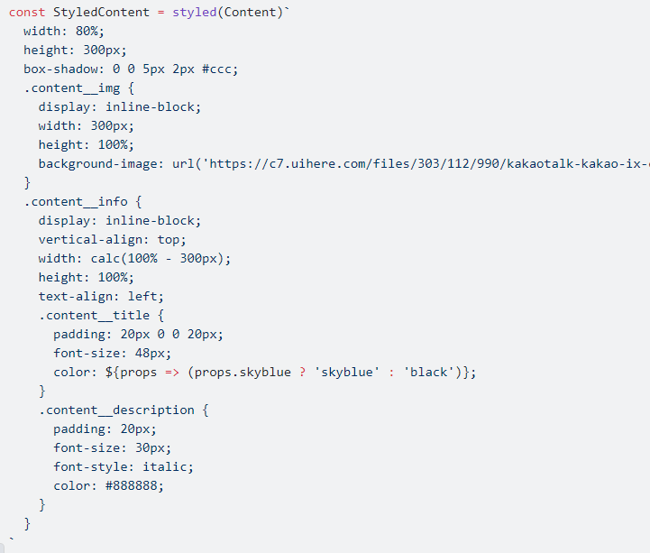
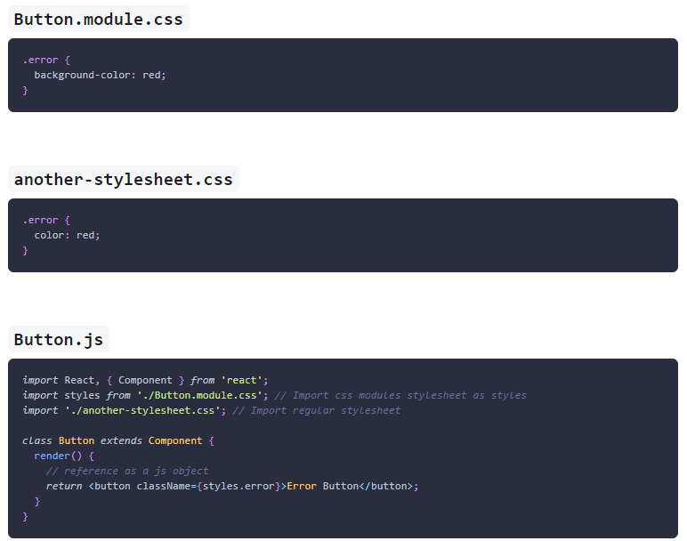

Có 2 cách style chính nên dùng cho component React:

(xem thêm
<https://viblo.asia/p/4-cach-de-style-react-components-OeVKB4w2lkW>,
<https://www.youtube.com/watch?v=NMiEREulVLc>)

\+ Import file CSS/SCSS vào component

\+ CSS-in-JS: inline styling, các library như styled-components

1.  **Với inline styling**

Ưu điểm:

\+ Đơn giản và nhanh với component cần ít style. Không cần tạo className
cho element, hay cài thêm thư viện để styled-components. Đơn giản chỉ
cần truyền giá trị vào thuộc tính style của element.

\+ Dynamic, có thể thay đổi trực tiếp giá trị style theo biến trong
component

Hạn chế:

\+ Không phải lựa chọn tốt để xây dựng ứng dụng lớn, yêu cầu performant,
scalable

\+ Không hỗ trợ css features như :hover, :active,\... (cần phải sử dụng
CSS-in-JS library)

\+ Dynamic nhưng khó đọc, debug khi component phức tạp

\+ Không hỗ trợ media queries

<https://blog.logrocket.com/why-you-shouldnt-use-inline-styling-in-production-react-apps/>

2.  **Với các libray như styled-components**

Đã giải quyết được các hạn chế của inline styling như css features,
media queries.

Style của toàn bộ component được tách riêng ra như sau:

<https://viblo.asia/p/style-css-cho-component-reactjs-nhu-the-nao-co-the-de-dang-debug-E375zwAqKGW>

So với import file css thì cách này sẽ dynamic hơn cụ thể sửa dụng được
props của component để hiển thị style tương ứng, tách riêng hoàn toàn
phần xử lý logic hiển thị element của component nên dễ debug hơn.

Ưu điểm:

\+ Dễ debug, tái sử dụng

\+ Dynamic

\+ Đóng gọi, giải quyết được vấn đề global scope của css

\+ Có thể sử dụng được scss syntax

\+ Theming

Nhược:

\+ Chỉ thay đổi style dựa vào props, với các xử lý dựa vào state thì
không thể. Cách giải quyết [lift the state
up](https://reactjs.org/docs/lifting-state-up.html) hoặc kết hợp sử dụng
inline style hoặc xửa lý qua className với import file css

\+ Tích hợp với css khó khăn

\+ Có thể lỗi thời nếu có công nghệ mới tốt hơn. Với CSS hay CSCC thì nó
ổn định hơn.

\+ Class name được tạo ngẫu nhiên, khó kiểm soát như component giống
nhau nhưng className khác nhau

3.  **SCSS**

Cách dùng: **import './Button.scss'**

Ưu điểm:

\+ Cộng đồng hỗ trợ nhiều, có thể dễ dàng tái sử dụng code cũ hoặc trên
mạng.

\+ Dễ tiếp cận cho người mới

\+ Dễ dàng hơn cho designer tham gia thiết kế qua file css

Hạn chế:

\+ Style component không đóng gói, cụ thể sẽ gây conflict nếu trùng
className

-   Có thể giải quyết bằng cách sử dụng BEM, quy tắc đặt tên cho
    className, với cách này sẽ hạn chế việc conflict className\
    <https://viblo.asia/p/tim-hieu-ve-bem-trong-15-phut-924lJOk65PM>

**Vấn đề: V**ới cách làm này developer sẽ tốn thời gian cho việc suy
nghĩ đặt tên class sao cho hợp đặc biệt với component phức tạp. Thêm nữa
sẽ có rủi ro bỏ sót, nhầm lẫn khiến className bị trùng lặp

**Giải pháp**: sử dụng CSS modules

Cách dùng:

CSS Modules sẽ tự tạo ra unique name cho mỗi class name trong css file.

Trong component nên kết hợp thêm BEM để việc đặt tên các class nhất quán
hơn

<https://medium.com/trabe/a-comprehensive-guide-to-using-bem-with-react-14d00c199e0d>

So sánh với styled-component:

\+ Sass vs styled-component

<https://stackshare.io/stackups/sass-vs-styled-components>

<https://spectrum.chat/styled-components/general/bem-sass-vs-styled-components~34b75b86-273d-434f-bc2b-dbb847678e89>

\+ Css-module vs styled-component

<https://stackoverflow.com/questions/52398582/what-is-the-benefit-of-using-styled-components-over-css-modules-in-reactjs>

<https://hashnode.com/post/css-modules-vs-styled-components-ciz2g9dt7000h7c535j35rbfu>

<https://spectrum.chat/styled-components/general/css-module-and-styled-components~7a82b161-623d-447c-8cf4-3a1c668ac116>

Kết luận: Css-module vs styled-component đều có cách xử lý tên class như
nhau tuy nhiên có chệnh lệch về performance, cụ thể css-module tốt hơn,
css-module dễ áp dụng hơn, không cần phải học thêm về kiến thức mới về
styled-component. Tuy nhiên styled-component sẽ tiện hơn khi code, hỗ
trợ theming và dynamic. Vậy nên để chọn cài nào phù hợp hơn thì nên xem
xét team thích code css-in-css hay css-in-js hơn.

Ý kiến cá nhận: css-in-css tốt hơn, dễ dev, code nhanh hơn, có thể sử
dụng lại file css cũ nhanh, viết css trong file .css/.scss thao tác dễ
hơn, khi dev không rebuild lại webpack (refresh lại page). Với dự án
nhỏ, vừa chỉ cần dùng BEM + SASS là đủ, với dự án lớn thì kết hợp thêm
CSS-Module.
