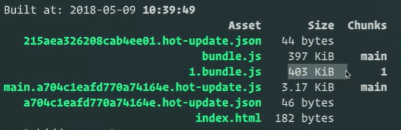
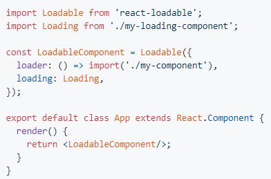

<https://frontendmasters.com/courses/performance-webpack>

**Tóm tắt:**

I. Web performance

\+ Nêu ra các yếu tố ảnh hưởng đến performance: lượng
javascript/css/network request khi khởi tạo

\+ Mục tiêu đạt chuẩn performace

\+ Giới thiệu code coverage ở dev tool chrome, thống kê code không sự
dụng, dư thừa

\+ Giới thiệu code splitting: 1 trong những kĩ thuật quan trọng nhất để
tăng performance web

II\. Code splitting

\+ Đi sâu vào code splitting: kĩ thuật giảm lượng code khi khởi tạo chưa
cần dùng đến, tăng performance

III\. Module Methed & Magic Comments

\+ Một số options mở rộng được cấu hình trong import: cách đặt
tên,mode,\... khi bundle

Contents {#contents .TOC-Heading}
========

I. [Web performance](#web-performance)

1. [Top Performance Issues](#top-performance-issues)

2. [Performance Goals](#performance-goals)

3. [Code Coverage](#code-coverage)

4. [Code Splitting](#code-splitting)

II. [Code Splitting](#code-splitting)

1. [Types of Code Splitting](#types-of-code-splitting)

2. [Webpack Code Splitting Under the Hood](#webpack-code-splitting-under-the-hood)

3. [Load a Heavy Module Asynchronously](#load-a-heavy-module-asynchronously)

4. [Code Splitting in Vue, React, & Frameworks](#code-splitting-in-vue,-react,-&-frameworks)

5. [Code Splitting Named Exports](#code-splitting-named-exports)

6. [Vendor Bundles are an Anti Pattern](#vendor-bundles-are-an-anti-pattern)

7. [Dynamic Code Splitting](#dynamic-code-splitting)

8. [Dynamic Code Splitting Walkthrough](#dynamic-code-splitting-walkthrough)

III. [Module Methods & Magic Comments](#module-methods-&-magic-comments)

1. [Introducing Magic Comments](#introducing-magic-comments)

2. [Webpack Modes](#webpack-modes)

3. [Webpack Prefetch & Preload](#webpack-prefetch-&-preload)

## Web performance

### Top Performance Issues

Performance here: How long does it take your app to load? How quickly
can it be interactive?

Top 3 web page load time causes:

\+ Amout of javascript for initial download: it is the most expensive
resource to load on website

\+ Amout of css for initial download

\+ Amout of network request on initial download: so this is gonna be
based on whether or not you're using http/2. It enables to have many
more concurrent network requests. So with http/2, you get more
flexibility to ship more resources. But it does not mean, for example,
if you\'re still shipping two megabytes of JavaScript, even if you just
split them out into like 200 chunks. You\'re still downloading two
megabytes of JavaScript and so you\'re not doing anything special by
splitting up those network calls, besides optimizing how fast it gets to
the browser

### Performance Goals

If you want a high performance web application that not only can be fast
loading on a computer. But fast loading on a mobile device, even fast
loading in emerging markets.

### Code Coverage

Open chrome devtool, Ctrl + Shift + P

-   Click reload

-   With this, you can identify how much code was used across this
    entire application for inital view

Unless you have full source mapping turned on, trying to identify what
the unused code is not very
friendly

### Code Splitting

Process of splitting pieces of your code into async chunks (at build
time). Seperate chunks of Javascript that will only be reloaded
asynchronously. When you use code splitting, you're creating these lazy
bundles in your build step. And they are accessed via Webpack in the
coded tranforms asynchronously.

This is the number one most important thing that you could walk away
with for enabling performance in your web applications.

## Code Splitting

Why is this important?

\+ The future of web is mobile

\+ The avarage mobile website takes 14 seconds to get interactive

\+ Load less code =\> interactive faster

### Types of Code Splitting

2 types:

\+ "Dynamic" (nothing in webpack that is purely dynamic) code splitting:

You'll never be able to do st like this: **import(someVar)**. Because
it's an anti-pattern

Example:

When hit button, the second Javascript géts loaded. This file only
contains your footer code

\+ Static code splitting:

When to use:

\+ "heavy" javascript: for example: you don't use some libary in initial
view page but some lazy route use it

\+ anything temporal: it's not there initially, it appears, and then
goes away, like modal, tooltip, dialog.

\+ routes

Did you call getModal a second time? Does it make a request?

-   It doesn't call a second time. It will request it but we find it in
    cache first and we just get the module back.

### Webpack Code Splitting Under the Hood

In bundle.js file

/\*\*\*\*\*\*/  function webpackJsonpCallback(data) {

/\*\*\*\*\*\*/    var chunkIds = data\[0\];

/\*\*\*\*\*\*/    var moreModules = data\[1\];

/\*\*\*\*\*\*/

/\*\*\*\*\*\*/    // add \"moreModules\" to the modules object,

/\*\*\*\*\*\*/    // then flag all \"chunkIds\" as loaded and fire callback

/\*\*\*\*\*\*/    var moduleId, chunkId, i = 0, resolves = \[\];

/\*\*\*\*\*\*/    for(;i \< chunkIds.length; i++) {

/\*\*\*\*\*\*/      chunkId = chunkIds\[i\];

/\*\*\*\*\*\*/      if(Object.prototype.hasOwnProperty.call(installedChunks, chunkId) && installedChunks\[chunkId\]) {

/\*\*\*\*\*\*/        resolves.push(installedChunks\[chunkId\]\[0\]);

/\*\*\*\*\*\*/      }

/\*\*\*\*\*\*/      installedChunks\[chunkId\] = 0;

/\*\*\*\*\*\*/    }

/\*\*\*\*\*\*/    for(moduleId in moreModules) {

/\*\*\*\*\*\*/      if(Object.prototype.hasOwnProperty.call(moreModules, moduleId)) {

/\*\*\*\*\*\*/        modules\[moduleId\] = moreModules\[moduleId\];

/\*\*\*\*\*\*/      }

/\*\*\*\*\*\*/    }

/\*\*\*\*\*\*/    if(parentJsonpFunction) parentJsonpFunction(data);

/\*\*\*\*\*\*/    while(resolves.length) {

/\*\*\*\*\*\*/      resolves.shift()();

/\*\*\*\*\*\*/    }

/\*\*\*\*\*\*/  };

/\*\*\*\*\*\*/  // The module cache

/\*\*\*\*\*\*/  var installedModules = {};

/\*\*\*\*\*\*/

/\*\*\*\*\*\*/  // object to store loaded and loading chunks

/\*\*\*\*\*\*/  // undefined = chunk not loaded, null = chunk preloaded/prefetched

/\*\*\*\*\*\*/  // Promise = chunk loading, 0 = chunk loaded

/\*\*\*\*\*\*/  var installedChunks = {

/\*\*\*\*\*\*/    0: 0

/\*\*\*\*\*\*/  };

/\*\*\*\*\*\*/

/\*\*\*\*\*\*/  // script path function

/\*\*\*\*\*\*/  function jsonpScriptSrc(chunkId) {

/\*\*\*\*\*\*/    return \_\_webpack_require\_\_.p + \"\" + chunkId + \".bundle.js\"

/\*\*\*\*\*\*/  }

Now, we not only have a module cache, we have a a chunk cache.

/\*\*\*\*\*\*/  \_\_webpack_require\_\_.e = function requireEnsure(chunkId) {

/\*\*\*\*\*\*/    var promises = \[\];

/\*\*\*\*\*\*/    // JSONP chunk loading for javascript

/\*\*\*\*\*\*/

/\*\*\*\*\*\*/    var installedChunkData = installedChunks\[chunkId\];

/\*\*\*\*\*\*/    if(installedChunkData !== 0) { // 0 means \"already installed\".

/\*\*\*\*\*\*/      // a Promise means \"currently loading\".

/\*\*\*\*\*\*/      if(installedChunkData) {

/\*\*\*\*\*\*/        promises.push(installedChunkData\[2\]);

/\*\*\*\*\*\*/      } else {

/\*\*\*\*\*\*/        // setup Promise in chunk cache

/\*\*\*\*\*\*/        var promise = new Promise(function(resolve, reject) {

/\*\*\*\*\*\*/          installedChunkData = installedChunks\[chunkId\] = \[resolve, reject\];

/\*\*\*\*\*\*/        });

/\*\*\*\*\*\*/        promises.push(installedChunkData\[2\] = promise);

/\*\*\*\*\*\*/

/\*\*\*\*\*\*/        // start chunk loading

/\*\*\*\*\*\*/        var script = document.createElement(\'script\');

/\*\*\*\*\*\*/        var onScriptComplete;

/\*\*\*\*\*\*/        script.charset = \'utf-8\';

/\*\*\*\*\*\*/        script.timeout = 120;

/\*\*\*\*\*\*/        if (\_\_webpack_require\_\_.nc) {

/\*\*\*\*\*\*/          script.setAttribute(\"nonce\", \_\_webpack_require\_\_.nc);

/\*\*\*\*\*\*/        }

/\*\*\*\*\*\*/        script.src = jsonpScriptSrc(chunkId);

/\*\*\*\*\*\*/

/\*\*\*\*\*\*/        // create error before stack unwound to get useful stacktrace later

/\*\*\*\*\*\*/        var error = new Error();

/\*\*\*\*\*\*/        onScriptComplete = function (event) {

/\*\*\*\*\*\*/          // avoid mem leaks in IE.

/\*\*\*\*\*\*/          script.onerror = script.onload = null;

/\*\*\*\*\*\*/          clearTimeout(timeout);

/\*\*\*\*\*\*/          var chunk = installedChunks\[chunkId\];

/\*\*\*\*\*\*/          if(chunk !== 0) {

/\*\*\*\*\*\*/            if(chunk) {

/\*\*\*\*\*\*/              var errorType = event && (event.type === \'load\' ? \'missing\' : event.type);

/\*\*\*\*\*\*/              var realSrc = event && event.target && event.target.src;

/\*\*\*\*\*\*/              error.message = \'Loading chunk \' + chunkId + \' failed.\\n(\' + errorType + \': \' + realSrc + \')\';

/\*\*\*\*\*\*/              error.name = \'ChunkLoadError\';

/\*\*\*\*\*\*/              error.type = errorType;

/\*\*\*\*\*\*/              error.request = realSrc;

/\*\*\*\*\*\*/              chunk\[1\](error);

/\*\*\*\*\*\*/            }

/\*\*\*\*\*\*/            installedChunks\[chunkId\] = undefined;

/\*\*\*\*\*\*/          }

/\*\*\*\*\*\*/        };

/\*\*\*\*\*\*/        var timeout = setTimeout(function(){

/\*\*\*\*\*\*/          onScriptComplete({ type: \'timeout\', target: script });

/\*\*\*\*\*\*/        }, 120000);

/\*\*\*\*\*\*/        script.onerror = script.onload = onScriptComplete;

/\*\*\*\*\*\*/        document.head.appendChild(script);

/\*\*\*\*\*\*/      }

/\*\*\*\*\*\*/    }

/\*\*\*\*\*\*/    return Promise.all(promises);

/\*\*\*\*\*\*/  };

The most important function is \_\_webpack_require\_\_.e. This is the
lazy loading transformation, this is what we convert a dynamic import in
our code

// import { footer } from \"./footer\";

const getFooter = () =\> \_\_webpack_require\_\_.e(/\* import() \*/ 1).then(\_\_webpack_require\_\_.bind(null, 8));

### Load a Heavy Module Asynchronously

Let use a heavy module: npm install gsap\@1.20.4 \--save-dev

-   You instantly not using about 80% of GSAP just by importing it.

How can we prevent this from happening? Let's say you don't actually
need it util you hit the button.

### Code Splitting in Vue, React, & Frameworks

Example with Vue.js

If someState always false, this component never gets loaded. This is
first class code splitting.

-   Think about it when you choose your technologies in the future.

With ReactJS: <https://github.com/jamiebuilds/react-loadable>

### Code Splitting Named Exports

For example: with lodash-es

You're gonna get a lot more code than what you actually expected. Right
now, we don't have the heuristic for webpack to determine what aren't
you using.

This way would ensure that you're only grabbing that individual granular
module. Even those it's hoisted up to a bunch of other utilities.

### Vendor Bundles are an Anti Pattern

The trade offs between using vendor bundles versus code splitting
entirely by the client's route?

Vendor Bundles are an Anti Pattern. This why in Webpack 4 we got rid of
commons chunk. We had so many people who would obsess like I can't
synthetically get these three modules to be in this one bundle and by
using common chunk, trying to optimize caching.

By catching, you\'re only saving yourself the network time it takes to
get that file.

So what you would find out is that by trying to do a bunch of caching,
you end up with these ginormous bundles. That you force entry points to
ship down the pipe, right, on your initial download. So I shouldn\'t
discount caching as an optimization, it is still valuable, but what I
tend to say, and maybe this is a little brash.

But it\'s like, come talk to me about caching when you get to 300
kilobytes of code on your initial download. And then we can take it a
step further, right? Because this is what\'s gonna save you tens of
seconds. Seven seconds on your load time, where caching is gonna maybe
save you 400 milliseconds.

### Dynamic Code Splitting

It's not true dynamic, but this is kind of a trick.

We can do something like this, we assign a variable to a function that
returns a dynamic import.

Loading an async bundle based on runtime conditions. How does this work?

\+ Expression: dynamic piece (themeName)

\+ Partial path: static piece.

Webpack take this partial path and find all the posible modules that can
resolve in it and create individual bundles for them. So it's not
dynamic, it's still static. We're creating these chunks at build timem

When to use:

\+ AB testing

\+ Theming

\+ Convenience

### Dynamic Code Splitting Walkthrough

## Module Methods & Magic Comments

### Introducing Magic Comments

> When we talk about magic comment, it's specifically for dynamic import
> statement.
>
> When you use code splitting as a technique. There is no name that is
> created when you add the bundle. Because it's not an entry point so we
> can't give it some assigned name.
>
> Solutions:
>
> <https://webpack.js.org/api/module-methods/>
>
> 
>
> With magic comment, you can add additional features. Specific to what
> the bundle is, or what modules get thrown into a bundle

const getFooter = () =\> import(/\* webpackChunkName: \"footer\" \*/ \"./footer\");

### Webpack Modes

Using webpack mode to define how the code splitting happens

-   \'lazy\' (default): Generates a lazy-loadable chunk for
    each import()ed module.

-   \'lazy-once\': Generates a single lazy-loadable chunk that can
    satisfy all calls to import(). The chunk will be fetched on the
    first call to import(), and subsequent calls to import() will use
    the same network response. Note that this only makes sense in the
    case of a partially dynamic statement,
    e.g. import(\`./locales/\${language}.json\`), where multiple module
    paths that can potentially be requested.

-   \'eager\': Generates no extra chunk. All modules are included in the
    current chunk and no additional network requests are made.
    A Promise is still returned but is already resolved. In contrast to
    a static import, the module isn\'t executed until the call
    to import() is made.

-   \'weak\': Tries to load the module if the module function has
    already been loaded in some other way (e.g. another chunk imported
    it or a script containing the module was loaded). A Promise is still
    returned, but only successfully resolves if the chunks are already
    on the client. If the module is not available, the Promise is
    rejected. A network request will never be performed. This is useful
    for universal rendering when required chunks are always manually
    served in initial requests (embedded within the page), but not in
    cases where app navigation will trigger an import not initially
    served.

I think lazy-once is really cool because you use it in dev mode for
build speed. Because the more lazy chunks you make, you have this linear
time complexity, because you have to create more bundles. Webpack has to
scan these bundles to optimize where the module should be placed.

This is a trick for performance optimizations in your dev mode

### Webpack Prefetch & Preload

what \<link rel=\"preload\"\> or prefetch does?

\+ Prefetch: Fetch while idle

\+ preload: This "Resource Hint" tells the browser that this is a
resource that is definitely needed for this navigation, but will be
discovered later. Chrome even prints a warning when the resource isn't
used 3 seconds after load. Browsers usually fetch this resource with
medium priority (not layout-blocking). To sum it up: Fetch like normal,
just earlier discovered.

By preloading a certain resource, you are telling the browser that you
would like to fetch it sooner than the browser would otherwise discover
it because you are certain that it is important for the current page.

This has a bunch of differences compared to prefetch:

-   A preloaded chunk starts loading in parallel to the parent chunk. A
    > prefetched chunk starts after the parent chunk finish.

-   A preloaded chunk has medium priority and instantly downloaded. A
    > prefetched chunk is downloaded in browser idle time.

-   A preloaded chunk should be instantly requested by the parent chunk.
    > A prefetched chunk can be used anytime in the future.

-   Browser support is different.

Due to this properties use cases are rare. It can be used if a module
always import() something instantly. It could make sense if a Component
depends on a big library that should be in a separate chunk.

Using webpackPreload incorrectly can actually hurt performance, so be
careful when using it.

-   This is basically a resource hint to the browser that says, hey,
    I\'m gonna need this file eventually. I\'m gonna need this asset, so
    load it for me? Eagerly load it, right? And it fetches while
    there\'s idle time, as well. it allows you to not have to have the
    additional cost of network call

\*Why is this usefull?

\+ Preload is used to discover resources earlier and avoid a
waterfall-like fetching. It's can bring down the page load to 2
round-trips (1. HTML, 2. all other resources). Using it doesn't cost
additional bandwidth.

\+ Prefetch is used to use the idle time of the browser to speed up
future navigations. Using it may cost additional bandwidth when the user
doesn't do the expected future navigation.

we added this new feature called webpack prefetch. So it\'s another
magic comment. Webpack prefetch and then also preload. this API will
either add link route prefetch for that chunk, or it would add link
route preload for that chunk and that resource. It automatically adds it
for you.

<https://medium.com/webpack/link-rel-prefetch-preload-in-webpack-51a52358f84c>

example:

